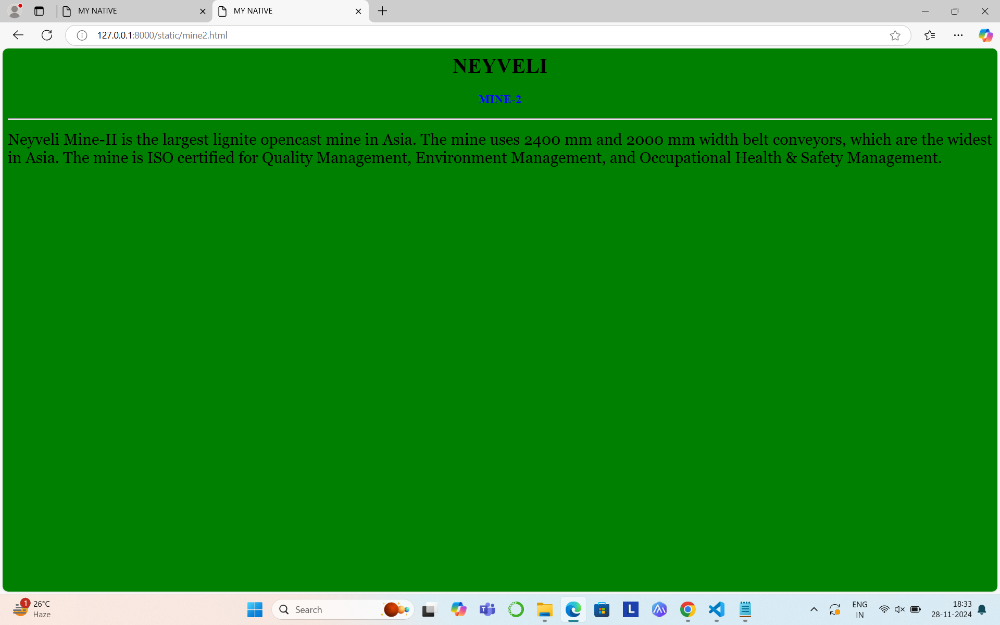
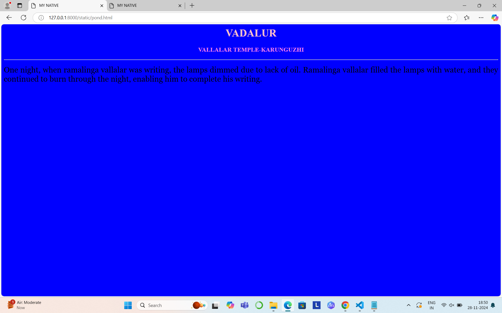

# Ex04 Places Around Me
## Date: 27/11/24

## AIM
To develop a website to display details about the places around my house.

## DESIGN STEPS

### STEP 1
Create a Django admin interface.

### STEP 2
Download your city map from Google.

### STEP 3
Using ```<map>``` tag name the map.

### STEP 4
Create clickable regions in the image using ```<area>``` tag.

### STEP 5
Write HTML programs for all the regions identified.

### STEP 6
Execute the programs and publish them.

## CODE
```
map.html
<html>
    <body> 
        <h1 align="center">
        <font color="red"><i><u>Vadalur</u></i></font>
        </h1>  
        <h2 align="center">
        <font color="blue"><u>Sukirthana M</u></font>
        </h2> 
        <center>
        
        <map name="image-map">
            <area target="" alt="VALLALAR TEMPLE" title="VALLALAR TEMPLE" href="temple.html" coords="924,737,1166,813" shape="rect">
            <area target="" alt="VALLALAR POND" title="VALLALAR TEMPLE-KARUNGUZHI" href="pond.html" coords="1191,972,117" shape="circle">
            <area target="" alt="MINE1A" title="MINE-IA" href="mine1.html" coords="827,555,1002,645" shape="rect">
            <area target="" alt="MINE2" title="MINE-2" href="mine2.html" coords="582,969,98" shape="circle">
            <area target="" alt="MURUGAR TEMPLE" title="VELLUDAYANPATTU TEMPLE" href="god.html" coords="1130,438,988,396" shape="rect">
        </map>
        </center>
    </body>      
</html>
temple.html
<html>
    <head>
        <title>MY NATIVE</title>
    </head>
    <body bgcolor="red">
    <h1 align="center">
     <font color="black"><b>VADALUR</b></font>
    </h1>
    <h3 align="center">
    <font color="blue"><b>VALLALAR TEMPLE-SATHYA GNANA SABAI</b></font>
    </h3>
    <hr size="3", colour="red">
    <p align="justify">
    <font face="Georgia" size="5">
        Sri Arutprakasa Ramalinga Vallalar opened a temple in Vadalur on January 25, 1872, called the Sathya Gnana Sabha.
        The temple hosts festivals and monthly puja dates, which attract thousands of visitors.
         The temple is octagonal in shape and has three sabhas, or halls:
         the Chirchabai which represents moon or left eye of people,
         the Porchabai  or golden sabha which represents the sun or right eye of people,
          the Gnana Sabai which represents the third eye or the wisdom of people.
         The sanctum sanctorum is hidden from the main hall by seven curtains, which are only parted on Thai Poosam day.
         The oven in the Dharma Sala that was lit by Sri Valallar in 1867 has never been extinguished and 153 years later, is still burning. 
         He initiated the Annadhanam, feeding the poor. This practice continues to this day.
    </font>
     </p>
    </body>
</html>
mine1.html
<html>
    <head>
        <title>MY NATIVE</title>
    </head>
    <body bgcolor="orange">
    <h1 align="center">
     <font color="violet"><b>VADALUR</b></font>
    </h1>
    <h3 align="center">
    <font color="blue"><b>MINE-IA</b></font>
    </h3>
    <hr size="3", colour="blue">
    <p align="justify">
    <font face="Georgia" size="5">
        The mine is 72-110 meters deep.The mine covers an area of 24.69 square kilometers.It is an opencast lignite mine.
        The mine has a capacity of 7 million tonnes per annum (MTPA). 
        The mine supplies the 600 megawatt (MW) Neyveli Thermal Power Station and the 420MW Thermal Power Station I Expansion. 
        The mine, which has been operating since 1962, is owned and operated by the Neyveli Lignite Corporation.
    </font>
     </p>
    </body>
</html>
mine2.html
<html>
    <head>
        <title>MY NATIVE</title>
    </head>
    <body bgcolor="green">
    <h1 align="center">
     <font color="black"><b>VADALUR</b></font>
    </h1>
    <h3 align="center">
    <font color="blue"><b>MINE-2</b></font>
    </h3>
    <hr size="3", colour="red">
    <p align="justify">
    <font face="Georgia" size="5">
        Neyveli Mine-II is the largest lignite opencast mine in Asia.
        The mine uses 2400 mm and 2000 mm width belt conveyors, which are the widest in Asia. 
        The mine is ISO certified for Quality Management, Environment Management, and Occupational Health & Safety Management.
    </font>
     </p>
    </body>
</html>
god.html
<html>
    <head>
        <title>MY NATIVE</title>
    </head>
    <body bgcolor="violet">
    <h1 align="center">
     <font color="pink"><b>VADALUR</b></font>
    </h1>
    <h3 align="center">
    <font color="white"><b>VELUDAYANPATTU TEMPLE</b></font>
    </h3>
    <hr size="3", colour="red">
    <p align="justify">
    <font face="Georgia" size="5">
        Veludayanpattu Sri Siva Subramania Swamy Temple, popularly called as Veludayanpattu Murugan Kovil is one among the most important temples of Neyveli. 
        Veludayanpattu Sri Siva Subramania Swamy Temple is said to be the oldest Hindu temple in the region that it was built at least 800 years ago. 
        The ancient temple is dedicated to the Tamil god of Lord Murugan.
        Veludayanpattu Sri Siva Subramania Swamy Temple is the home of a unique primary deity where Lord Muruga is seen with a bow and seven arrows instead of his regular weapon of 'Vel'
    </font>
     </p>
    </body>
</html>
```

# OUTPUT







## RESULT
The program for implementing image maps using HTML is executed successfully.
